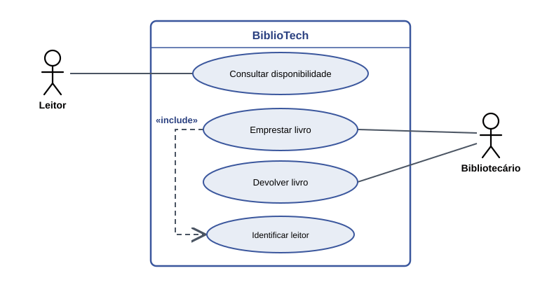
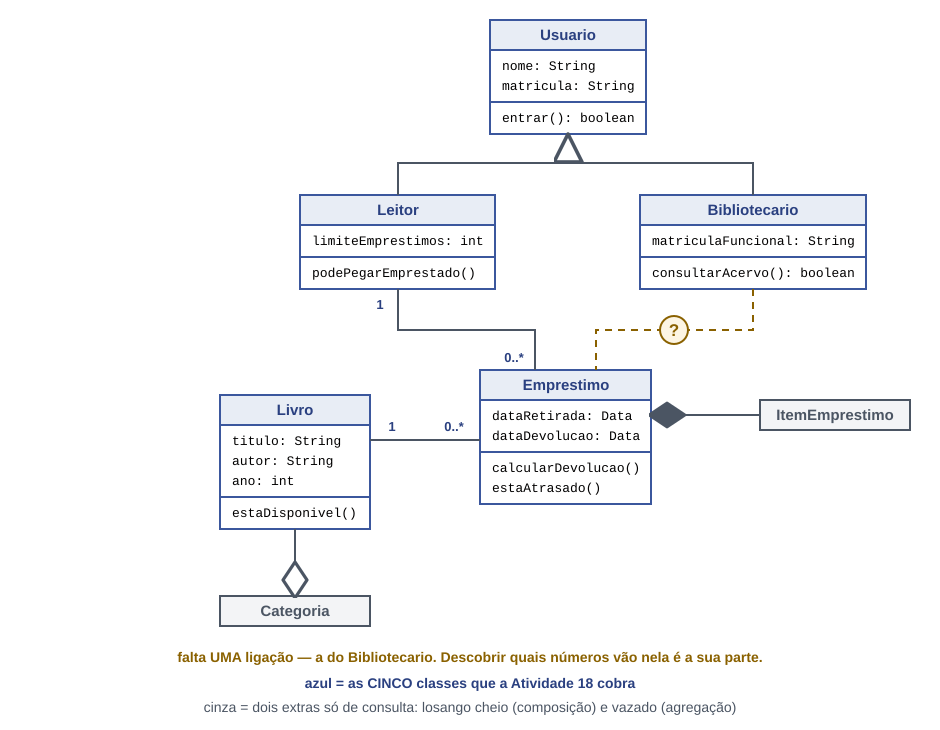

# BiblioTech - Sistema de emprestimo de livros para a biblioteca do campus.

## 1. O projeto

O BiblioTech foi criado para informatizar a gestao da biblioteca do campus, acabando com a desorganizacao e a demora no controle manual de emprestimos, prazos e disponibilidade do acervo.  O cliente do projeto e a propria biblioteca do campus, e o sistema atende toda a comunidade academica -alunos, professores e funcionarios- tornando a busca e a retirada de livros mais agil e transparente

* Quem e o cliente: A biblioteca do campus
* Que problema resolve: A desorganizacao e a demora no controle manual de emprestimos, prazos e estoque de livros
* Para quem: Alunos, professores e funcionarios do campus

## 2. Historias de usuario

| # | Historia de usuario |
| --- | --- |
| HU01 | Como leitor, quero consultar a disponibilidade de um livro, para saber se posso pega-lo emprestado sem ir ate o balcao. |
| HU02 | Como leitor, quero devolver um livro, para nao ficar com pendencia na biblioteca. |
| HU03 | Como bibliotecaria, quero registrar um emprestimo, para saber quem esta com cada exemplar. |
| HU04 | Como bibliotecaria, quero cadastrar um livro novo, para que ele possa ser encontrado no sistema. |
| HU05 | Como bibliotecaria, quero ver os emprestimos atrasados, para cobrar a devolucao. |

## 3. Requisitos

### Requisitos funcionais

| # | Requisito funcional | Veio da |
|---|---|---|
| RF01 | O sistema deve permitir que a bibliotecaria cadastre um livro no acervo. | HU04 |
| RF02 | O sistema deve permitir que a bibliotecaria cadastre um leitor. | regra de acesso: so quem tem cadastro leva livro |
| RF03 | O sistema deve permitir que o leitor consulte a disponibilidade de um livro. | HU01 |
| RF04 | O sistema deve permitir que a bibliotecaria registre a devolucao de um livro. | HU02 |
| RF05 | O sistema deve permitir que a bibliotecaria registre o emprestimo de um livro. | HU03 |
| RF06 |O sistema deve permitir que a bibliotecaria bloqueie o leitor com pendencia de devolucao. | regra da biblioteca: leitor em atraso nao pode realizar novos emprestimos |
| RF07 |O sistema deve permitir que o leitor reserve um livro indisponivel. | HU06 |

### Requisitos nao funcionais

| # | Requisito nao funcional |
|---|---|
| RNF01 | A consulta de disponibilidade deve responder em menos de 3 segundos. |
| RNF02 | Somente usuarios identificados como bibliotecarios podem alterar o acervo. |

## 4. Diagramas (feitos em APS)

### Casos de uso

### Classes

